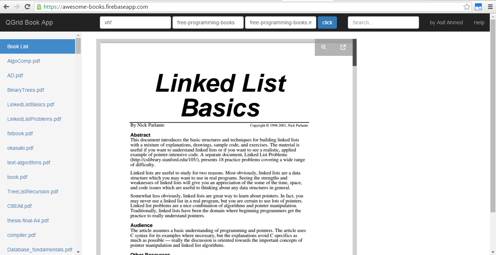

# QGrid-Github-API-Book-List-and-View-App
This app uses github api to get data from a specifc user repo. Then it parses all the pdf links in them and show them in list. User can click on any book name to view it instantly.

## Live App:
https://awesome-books.firebaseapp.com/

## Sample Input:
user name: vhf

repo name: free-programming-books

directory name: free-programming-books.md

## Screenshot:
Type the github user name in user name section, then the repo name then the directory name or file name if its in root folder.

